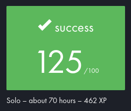
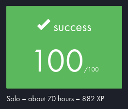
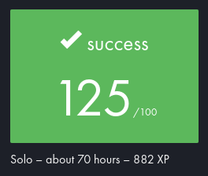

# QuoicouLibft
## 42 Project
### Library of useful recoded functions in C
## Subjects
- ### [Libft](./subjects/en.subject.libft.pdf)

- ### [Printf](./subjects/en.subject.printf.pdf)

- ### [Get Next Line](./subjects/en.subject.gnl.pdf)


## Cramptos
Quoi ?

Je laisse copilot ecrire la suite (-- = ses phrases):

--

``` c
int main(void)
{
  printf("Hello World");
  return (0);
}
```
-- Il est cool ce copilot, il m'aide beaucoup.

Il est c** ouais pour qui tu te prends ? 

-- Je suis le meilleur.

Ah ok pardon

-- C'est pas grave, je te pardonne.

Merci

-- De rien, c'est normal.

...

-- Tu veux que je t'aide ?

Je veux bien que tu m'aides à faire le Readme stp

-- Ok, je vais t'aider.

Merci

-- De rien, c'est normal.

...


## Auteur
* **Quentin COUCHOUD** - [Quentin Coucho](

Ben non je suis pas Quentin Coucho

-- Et moi je suis pas Quentin Coucho

-- Et moi je suis pas Quenti

-- Et moi je suis pas Quentin Coucho


-- Un jour je serai le meilleur dresseur

-- Je me battrai sans répit

-- Je ferai tout pour être vainqueur

-- Et gagner les défis

-- Je parcourrai la terre entière

-- Traquant avec espoir

-- Les Pokémon et leurs mystères

-- Le secret de leurs pouvoirs

-- Pokémon ! Attrapez-les tous

-- C'est notre histoire

-- Ensemble pour la victoire

-- Pokémon ! Rien ne nous arrêtera

-- Notre amitié triomphera

-- Pokémon ! Attrapez-les tous

-- Même à notre âge

-- Un voyage d'apprentissage

-- Pokémon ! Attrapez-les tous

-- Attrapez-les tous

-- Pokémon !

-- Attrapez-les tous

-- Attrapez-les tous

-- Attrapez-les tous

-- Pokémon ! Attrapez-les tous

-- C'est notre histoire

-- Ensemble pour la victoire

-- Pokémon ! Rien ne nous arrêtera

-- Notre amitié triomphera

-- Pokémon ! Attrapez-les tous

-- Même à notre âge

-- Un voyage d'apprentissage

-- Pokémon ! Attrapez-les tous

-- Attrapez-les tous

-- Pokémon !

Il est dans une boucle infinie..
